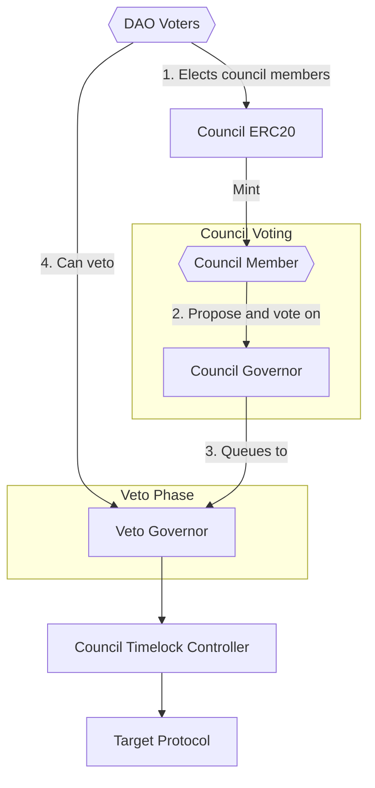

# Optimistic Governance

**Goal**: Safely empower DAOs to extend decisionmaking to councils, while maintaining oversight via veto voting.

This repository implements new OpenZeppelin Governor extensions to ultimately achieve a dual-governor "Optimistic Governance" system, designed for a Council-based proposal process with a veto check from governance token holders.



Included is a ["Council Governor"](src/BasicCouncilGovernor.sol) and a ["Veto Governor."](src/BasicCouncilVetoGovernor.sol) We imagine a proposal flow where a council member (holder of `CouncilERC20`) creates a proposal on the Council Governor. If the council members agree, then it'll be queued on the Veto Governor, where token holders can vote to veto the proposal. If the veto period expires without a veto, then it'll be executed. If the veto votes reach a minor threshold, the voting period gets extended. That being said, we've tried to be general with our extension contracts, such that certain features could be omitted, or could be used outside of a 2-governor setup (e.g. replace council governor with multisig).

## Extensions & Features

The system is built by composing OpenZeppelin's modular Governor system together with custom extensions found in `src/extensions`:

| Extension                                | Used By          | Purpose                                                                                                                                                                                                                                           |
| :--------------------------------------- | :--------------- | :------------------------------------------------------------------------------------------------------------------------------------------------------------------------------------------------------------------------------------------------ |
| **`GovernorAdmin`**                      | Both             | Allows governance parameters to be controlled by an external entity (i.e. DAO) rather than by council governance itself. This gives the DAO control over council governance configuration!                                                        |
| **`GovernorCouncilQueuing`**             | Council Governor | Gives the council governor the ability to forward successful proposals to the veto governor.                                                                                                                                                      |
| **`GovernorVetoCountingSimple`**         | Veto Governor    | Changes voting logic to only count `Against` votes. Used by the Veto Governor, and measures votes against a veto threshold. Also disables "quorum," a concept idiomatic to normal governors but not applicable in an optimistic governor context. |
| **`GovernorExtendVetoPeriod`**           | Veto Governor    | Allows defining a veto extension period and a minor veto threshold, which extends the veto period if significant opposition arises.                                                                                                               |
| **`GovernorVetoGuardian`**               | Veto Governor    | Adds a specific "Guardian" role that can unilaterally veto proposals (separate from the token-holder veto).                                                                                                                                       |
| **`GovernorVetoOverride`**               | Veto Governor    | Grants a guardian/admin the power to un-veto a proposal, ensuring the system doesn't get stuck. In [BasicCouncilVetoGovernor](src/BasicCouncilVetoGovernor.sol), supercedes the veto guardian.                                                    |
| **`GovernorVotesVetoThresholdFraction`** | Veto Governor    | Allows defining the veto threshold as a percentage of total supply.                                                                                                                                                                               |

## System Overview

## Core Components

### CouncilERC20 (Membership)

Implements **Role-Based Membership**.

- **Design**: A specialized ERC20 token that represents a "seat" on the council.
- **Permissions**: The contract is `Ownable`. The owner (typically the Main DAO) has exclusive rights to `mint` (add members) and `burn` (remove members).
- **Transferability**: Tokens are non-transferable to ensure a council consistent with DAO intention.
- **Usage**: Used by the `BasicCouncilGovernor` to determine council makeup and weigh votes (1 token = 1 vote).

### BasicCouncilGovernor

The primary entry point for proposals.

- **Council-Only Proposals**: Proposals can only be created by accounts holding `CouncilERC20` tokens (`proposalThreshold` = 1).
- **Standard Voting**: Council members vote `For`, `Against`, or `Abstain`.
- **Quorum**: A standard quorum must be met for a proposal to pass.
- **Super Quorum (Extension)**: Implements `GovernorSuperQuorum`. If a defined "Super Quorum" threshold is met (e.g., unanimous or near-unanimous agreement), the voting period ends early, and the proposal is immediately forwarded to the Veto Governor.

### BasicCouncilVetoGovernor

The safety layer that protects the protocol from malicious or contentious council actions.

- **Proposal Gating**: Only successful proposals from the Council Governor can be `propose`d here, via the CouncilGovernor's `queue` function.
- **Veto-Only Voting**: Implements `GovernorVetoCountingSimple`. DAO token holders use their standard governance tokens to vote. Only `Against` votes (vetoes) are counted.
- **Veto Threshold**: A specific veto threshold is defined for vetoes. If the number of veto votes exceeds this threshold, the proposal is defeated.
- **Veto Extension**: Implements `GovernorExtendVetoPeriod`. If a minor veto threshold is met, the voting period is automatically extended to allow more time for the community to react.
- **Veto Override**: Implements `GovernorVetoOverride`. A trusted "Veto Override Role" (e.g., the Main DAO or a Guardian multisig) can manually override a successful veto within a specific time window, enabling the proposal to be queued. This acts as a fail-safe against veto spam or malicious blocking.

## User Flows

1.  **Council Action**:
    - Member creates proposal on `BasicCouncilGovernor`.
    - Council votes.
    - If `For` votes > `Against` votes and quorum is met, proposal succeeds (or succeeds early via `Super Quorum`).
2.  **Veto period**:
    - Proposal is queued to `BasicCouncilVetoGovernor`.
    - Veto Voting Period starts.
    - Token holders can vote `Against`.
    - If `Against` votes meets minor veto threshold, the voting period is extended.
    - If `Against` votes meets veto threshold, the proposal is defeated.
    - If `Against` votes does not meet veto threshold, the proposal is queued to `Timelock`.
3.  **Execution**:
    - **If Veto Threshold NOT met**: Proposal succeeds -> Queued in Timelock -> Executed.
      - _Optional_: Veto guardian can intervene to veto the proposal while it is pending or active.
    - **If Veto Threshold IS met**: Proposal is Defeated.
      - _Optional_: Veto Override Role can intervene to override the veto and queue the proposal, as long as the override period has not expired. This supercedes the veto guardian.

## Installation

```bash
git clone https://github.com/withtally/optimistic-governance.git
cd optimistic-governance
forge install
```

## Build & Test

```bash
# Build
forge build

# Run tests
forge test

# Run tests with gas report
forge test --gas-report

# Generate coverage report
forge coverage
```

## Documentation

Generate API documentation from NatSpec:

```bash
forge doc --serve
```

## Deployment

See the deployment scripts in `script/`:

- [`DeployGovernorsAndGrantRoles.s.sol`](script/DeployGovernorsAndGrantRoles.s.sol) - Deploys both governors and configures timelock roles
  - Set the deployment params in script/deploy-constants

## Security Considerations

> [!CAUTION]
> This code has not been audited. Use at your own risk.

### Key Risks

1. **Admin Misconfiguration**: The `GovernorAdmin` extension allows external control over governance parameters. A malicious or compromised admin could misconfigure the governors (e.g., setting `votingPeriod` to 0).

2. **Veto Threshold Manipulation**: If `vetoThresholdNumerator` is set too high, proposals become effectively un-vetoable. If set too low, proposals can be griefed.

3. **Override Window**: The `vetoOverrideDuration` creates a window where a defeated proposal can be revived. This is intentional but requires careful tuning.

4. **State Override Composition**: Multiple extensions override `state()`. The order of inheritance matters:
   - `GovernorVetoGuardian` → `GovernorVetoOverride` → other extensions
   - Override takes precedence over Guardian veto

### Access Control Summary

| Role                    | Permissions                                                   |
| ----------------------- | ------------------------------------------------------------- |
| **Council Member**      | Propose and vote on `BasicCouncilGovernor`                    |
| **Token Holder**        | Vote to veto on `BasicCouncilVetoGovernor`                    |
| **Veto Guardian**       | Unilaterally veto pending/active proposals                    |
| **Veto Override Role**  | Override a veto within the override window                    |
| **Governor Admin**      | Modify governance parameters (delay, period, thresholds, etc) |
| **Council Token Owner** | Mint/burn council membership tokens                           |
